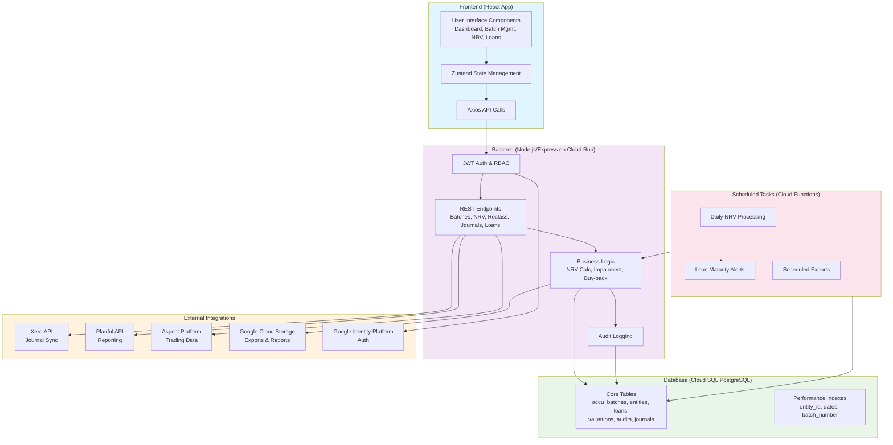

# ACCU Valuation & Classification Engine - High-Level Architecture

## Overview
The system follows a hybrid development approach: Define core database schema first, then iteratively build frontend components while planning backend APIs and integrations. The architecture is cloud-native on Google Cloud, ensuring scalability, security, and compliance with AASB standards.

## Key Components

### Frontend (React 18 + TypeScript + Tailwind CSS)
- **State Management**: Zustand for global state (e.g., entities, batches, user sessions).
- **UI Library**: Tailwind CSS for responsive design; Recharts for visualizations.
- **Routing**: React Router for navigation between Dashboard, Batch Management, NRV Checker, etc.
- **API Client**: Axios for REST calls to backend.
- **Key Features**: Multi-entity switching, real-time updates via WebSockets (if implemented), offline support for critical views.

### Backend (Node.js/Express on Google Cloud Run)
- **API Layer**: RESTful endpoints with JWT authentication via Google Identity Platform.
- **Business Logic**: NRV calculations, impairment detection, reclassification workflows, loan management.
- **Integrations**: 
  - Xero: Journal entry sync via API.
  - Planful: Report data export.
  - Aspect: Trade/position updates.
- **Scheduled Tasks**: Daily NRV processing, loan maturity alerts via Google Cloud Functions.
- **Security**: RBAC, input validation, audit logging for all actions.

### Database (Google Cloud SQL - PostgreSQL)
- **Schema**: 12+ tables with strict typing, indexes on frequent queries (e.g., batch_number, entity_id, dates).
- **Relationships**: Foreign keys between batches, entities, loans, valuations, audits.
- **Data Isolation**: Row-level security or tenant_id (entity_id) for multi-entity support.
- **Alternative**: Cloud Firestore for NoSQL if real-time needs dominate.

### Integrations & External Services
- **Authentication**: Google Cloud Identity Platform.
- **Storage**: Google Cloud Storage for exports, reports, XBRL files.
- **Monitoring**: Google Cloud Monitoring/Logging.
- **CI/CD**: Google Cloud Build.

## System Flow Diagram

## Data Flow for Core Features
- **Batch Management**: User creates batch → Backend validates & stores in accu_batches → Audit log entry.
- **NRV Checker**: Scheduled function fetches market prices → Calculates impairment per batch → Updates valuation_logs → Alerts if threshold exceeded.
- **Loan Management**: Create loan → Link to batch → Adjust NRV for loaned quantities → Schedule buy-back.
- **Reclassification**: Submit request → Workflow approval → Update classification in batch → Generate journal entry → Sync to Xero.
- **XBRL Reporting**: Select batches → Generate tags using taxonomy → Export XML to GCS.

## Multi-Entity Support
- All queries filter by entity_id.
- Entity switching in frontend updates global state and API params.
- Cross-entity reports aggregate data with user permissions.

## Compliance & Security
- **AASB Integration**: Use existing taxonomy for XBRL tagging (e.g., map classifications to Inventories/Intangibles/FVTPL).
- **Audit Trail**: Immutable logs in audit_log_entries for all changes.
- **RBAC**: Roles (Admin, Entity Manager, Viewer) checked at endpoint level.

## Deployment
- **Frontend**: Build to static files → Deploy to GCS + CDN.
- **Backend**: Containerized on Cloud Run with auto-scaling.
- **Database**: Cloud SQL with automated backups.
- **CI/CD**: Git push triggers Cloud Build → Deploy to environments (dev/staging/prod).

This architecture ensures scalability, compliance, and seamless integrations. Next steps: Refine schema details and start frontend iteration.