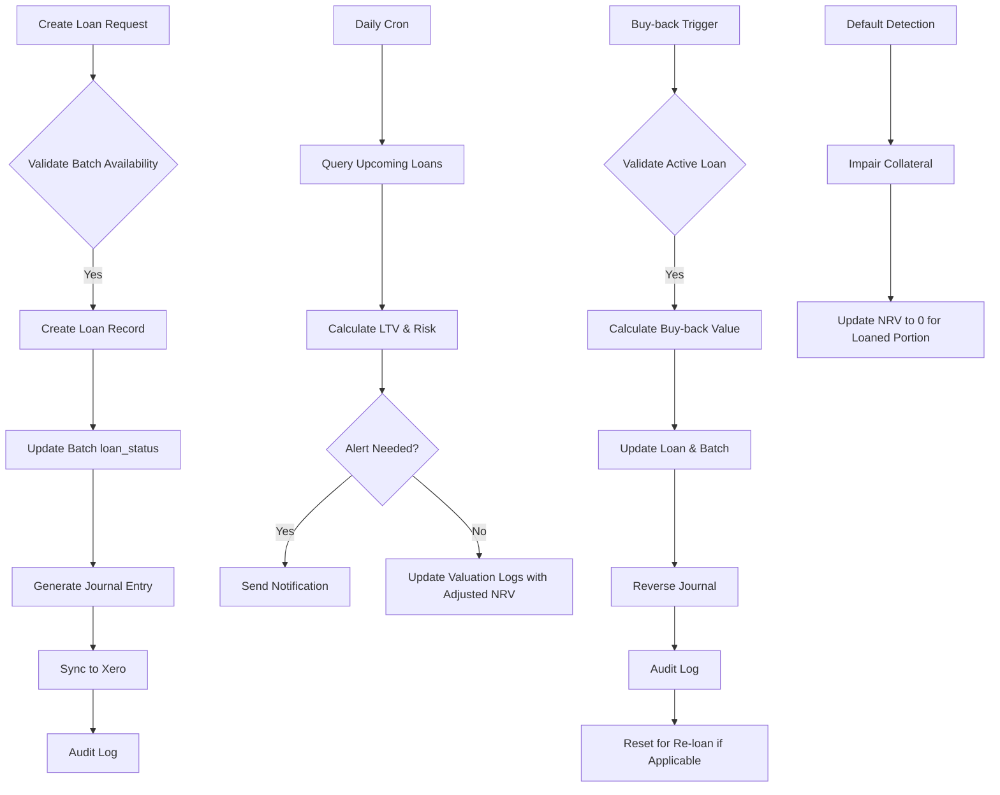

# Loan Management Logic Outline for ACCU Valuation & Classification Engine

## Overview
Loan functionality handles ACCU batch lending to creditors, with buy-back scheduling, risk assessment, and NRV adjustments. Logic ensures AASB compliance (e.g., collateral valuation, impairment on loaned assets). Integrated with batches (loan_status, loan_details JSON), valuations (adjust NRV for loaned quantity), and journals (buy-back entries). Mock creditor data initially; real integration later. Key calculations: Loan-to-Value (LTV = loan_amount / (loaned_quantity * current_market_price)), Default Probability (simple threshold-based, e.g., if buyback_date overdue > 30 days).

Business Rules:
- Loans link to specific batches; partial quantities allowed (e.g., loan 50% of batch).
- NRV Adjustment: For loaned batches, effective NRV = (total_nrv * (1 - loaned_ratio)) + collateral_value.
- Buy-back: Auto-process on buyback_date or manual; updates loan_status to 'completed', reverses loan journal, resets batch loan_status.
- Risk: Alerts if LTV > 80% or maturity < 7 days; default if overdue without buy-back.
- Audit: Log all loan actions (create, update, buy-back).

## Core Logic Flows

### 1. Loan Creation
- **Input**: {batch_id, creditor_id, quantity (≤ batch.quantity), loan_amount, buyback_rate (%), buyback_date, terms: {interest_rate, duration_days}}.
- **Validation**: Quantity available (not already loaned), buyback_date > current, loan_amount ≤ (quantity * acquisition_cost).
- **Process**:
  1. Create loan record in loans table.
  2. Update accu_batches: loan_status=true, loan_details={loan_id, loaned_quantity}.
  3. Generate journal: Debit 'Loan Receivable' (loan_amount), Credit 'ACCU Inventory' (loan_amount).
  4. Calculate initial collateral_value = quantity * current_market_price.
  5. Audit log: 'loan_created'.
- **Output**: Loan ID, updated batch.

### 2. Loan Tracking & Maturity Alerts
- **Daily Cron (Cloud Function)**: Query loans where buyback_date = today + 7 days → Send alerts via email/notification (integrate with service).
- **Risk Assessment**:
  - LTV = loan_amount / collateral_value; if > threshold (80%), flag 'high_risk'.
  - Default Prob: If (buyback_date - now) < 0 and no buy-back, status='default', impair full collateral.
  - Update valuation_logs with loan-adjusted NRV daily.
- **API Query**: /api/loans/maturity?days=30 → Returns upcoming loans with risk scores.

### 3. Buy-back Processing
- **Manual Trigger**: POST /api/loans/:id/buyback {actual_buyback_amount}.
- **Auto Trigger**: On buyback_date, if not manual.
- **Process**:
  1. Validate: Loan active, batch exists.
  2. Calculate buyback_value = loaned_quantity * (acquisition_cost * (1 + buyback_rate/100)).
  3. If actual < buyback_value, impair difference.
  4. Update loan: status='completed', completed_at=now.
  5. Update batch: loan_status=false, loan_details=null; add notes 'Buy-back completed'.
  6. Generate reverse journal: Debit 'ACCU Inventory' (buyback_value), Credit 'Loan Receivable' (loan_amount), handle gain/loss.
  7. If same-day re-loan: Allow immediate new loan creation.
  8. Audit log: 'loan_buyback'.
- **Impairment**: If default, write-off collateral, update NRV to 0 for loaned portion.

### 4. Re-loan (Same-Day Buy-back)
- **Logic**: After buy-back, batch loan_status resets; new loan can be created immediately.
- **Validation**: Ensure no overlapping loans on same batch quantity.
- **Journal**: Chain entries for seamless accounting.

### 5. Integration Points
- **Xero**: Auto-sync loan creation/buy-back journals.
- **NRV**: In daily process, for loaned batches: nrv_adjusted = nrv * (available_quantity / total_quantity) + (collateral_value * recovery_rate (default 70%)).
- **Dashboard**: Loan summary metrics (total loaned value, upcoming maturities, high-risk count).
- **Reports**: Export loan portfolio CSV with LTV, status, creditor.

## Data Flow Diagram

## Edge Cases
- Partial Buy-back: Prorate quantity, update remaining loan.
- Batch Reclass While Loaned: Block or require loan completion first.
- Multi-Entity: All loans scoped to entity_id.
- Currency: Assume AUD; extend for multi-currency if needed.

This logic ensures compliant, automated loan handling. Implement in backend services.